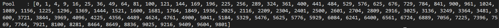
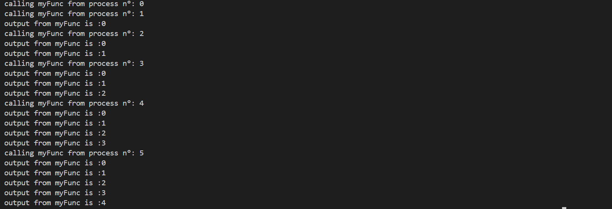

# Chapter 3
# PRINCE IRSHAD (23FA-035-CS)
---

## Table of Contents
* [1. communicating_with_pipe](#1-communicating_with_pipe)
* [2. communicating_with_queue](#2-communicating_with_queue)
* [3. killing_processes](#3-killing_processes)
* [4. myFunc](#4-myfunc)
* [5. naming_processes](#5-naming_processes)
* [6. process_in_subclass](#6-process_in_subclass)
* [7. process_pool](#7-process_pool)
* [8. processes_barrier](#8-processes_barrier)
* [9. run_background_processes](#9-run_background_processes)
* [10. run_background_processes_no_daemons](#10-run_background_processes_no_daemons)
* [11. spawning_processes](#11-spawning_processes)
* [12. spawning_processes_namespace](#12-spawning_processes_namespace)

---

#### 1. communicating_with_pipe
* **What I Learned:** I learned how to use Python’s `multiprocessing.Pipe` to establish a direct, high-speed, two-way communication channel between different processes. This allows distinct CPU operations to send and receive raw data efficiently without relying on shared memory variables.
* **How it Executes:** The script creates two separate processes and two duplex (two-way) pipes. The first process (Producer) dynamically generates numbers from 0 to 9 and sends them one by one through `pipe_1`. The second process (Worker) receives these numbers, calculates their square to simulate data processing, and sends the final results into `pipe_2`. The main script acts as the final consumer, continuously reading from `pipe_2` until the connection is safely closed.
* **Code Understanding:** * `multiprocessing.Pipe(True)` initializes a duplex connection where both ends of the pipe have the ability to read and write.
  * The `.send()` method is utilized to inject Python objects into the pipe, while `.recv()` is a blocking call that waits for and extracts incoming data.
  * Exception handling using a `try...except EOFError` block is absolutely crucial here; it acts as a safe mechanism to break the reading loop when the pipe is empty and closed, preventing the entire program from crashing.
  * The `.close()` method is called manually at the end of operations to free up system memory and release file descriptors.
* **End Use:** This is highly useful in multi-stage data processing pipelines where Step A must pass raw data directly to Step B securely, such as passing video frames from a decoder to a rendering engine.
* **Short Summary:** This script demonstrates point-to-point inter-process communication (IPC) using pipes, creating a sequential data flow from a producer, to a processor, and ultimately back to the main script.
* **Pros & Cons:** * **Advantages:** It provides extremely fast execution for two-way communication and is very simple to implement when you only have exactly two endpoints communicating.
  * **Disadvantages:** Pipes are strictly limited to two endpoints. If multiple processes attempt to read or write to the exact same pipe simultaneously, severe data corruption or application crashes will occur.
* **Output:** 

---

#### 2. communicating_with_queue
* **What I Learned:** I learned how to utilize `multiprocessing.Queue` to create a process-safe, shared memory space. This is the perfect mechanism for implementing the Producer-Consumer architecture across multiple CPU cores without manually writing complex lock mechanisms.
* **How it Executes:** The program initiates two parallel processes. The Producer process generates random integers and pushes them into the shared queue, pausing slightly between each insertion to simulate a real workload. Simultaneously, the Consumer process continuously polls the queue. If it finds data, it pops the item out for processing; if the queue becomes entirely empty, the consumer safely breaks its infinite loop and terminates gracefully.
* **Code Understanding:** * `multiprocessing.Queue()` creates a robust FIFO (First-In, First-Out) data structure that handles its own background locking, ensuring absolute data integrity.
  * The `.put(item)` method safely injects data into the shared queue without the risk of overwriting other processes' data.
  * The `.get()` method retrieves and instantly removes the oldest item from the queue for processing.
  * The `.empty()` method checks the queue's status, though it is important to note that in highly parallel systems, this can sometimes be slightly out of sync.
* **End Use:** This is the industry standard approach for task scheduling, managing background job processing workers, and handling massive asynchronous workloads like web scraping, sending bulk emails, or processing real-time data streams.
* **Short Summary:** The code utilizes an inherently process-safe Queue to allow a producer process to seamlessly and securely pass dynamically generated data to a consumer process running entirely in parallel.
* **Pros & Cons:** * **Advantages:** It is inherently process-safe, eliminating the need for manual Mutexes or Locks, and it is highly scalable for multiple producers and consumers.
  * **Disadvantages:** It introduces a slight IPC overhead due to the serialization (pickling) of data, and methods like `.empty()` or `.qsize()` can sometimes be unreliable across different operating systems.
* **Output:** 

---

#### 3. killing_processes
* **What I Learned:** I learned the critical mechanisms of forcing a process to stop before its natural completion using the `.terminate()` method, as well as how to accurately monitor its active state and exit conditions.
* **How it Executes:** A process is initialized to run a target function that contains a deliberate 10-second sleep loop. The main script checks the process's status before starting it, starts the process, checks the status again to confirm execution, and then immediately issues a harsh termination signal. After the process is killed, the main script joins it and prints the final exit code.
* **Code Understanding:** * The `.is_alive()` method returns a dynamic boolean value indicating whether the process is currently executing in the background.
  * The `.terminate()` method sends a SIGTERM signal directly to the Operating System, killing the process instantly without waiting for its current task to finish.
  * The `.join()` method is still strictly required after termination to reclaim OS resources and prevent the creation of memory-hogging "zombie" processes.
  * The `.exitcode` attribute returns a negative integer, which acts as proof that the process was forcefully terminated rather than finishing naturally.
* **End Use:** This technique is crucial for building system fail-safes, enforcing network request timeouts, or killing background GUI workers that have frozen and become unresponsive.
* **Short Summary:** The script demonstrates aggressive lifecycle management by forcefully aborting a runaway process and handling the necessary system cleanup afterward.
* **Pros & Cons:** * **Advantages:** It grants the developer immediate and absolute control over runaway or hanging processes.
  * **Disadvantages:** It is highly unsafe for active file writing or database operations, as the abrupt termination will bypass cleanup routines and likely corrupt data.
* **Output:** 

---

#### 4. myFunc
* **What I Learned:** I learned the standard architectural practice of defining isolated, independent functions to serve as the distinct computational workloads for multiprocessing tasks.
* **How it Executes:** This file contains a simple function definition that accepts a numerical parameter `i`. When executed inside a spawned process, it runs a loop based on the value of `i`, printing its progress to the console to simulate active CPU work.
* **Code Understanding:** * The `for` loop dynamically runs based on the `i` value passed during the process creation, demonstrating how arguments control workload size.
  * The `print` statements are utilized specifically to track the execution flow and prove that the function is actively running in the background.
  * The `return` statement at the end of the function acts as a formal signal for process completion, allowing the process to exit cleanly.
* **End Use:** Functions like this are used as the foundational building blocks for parallel applications, acting as the designated target logic for process pools or individual worker instances.
* **Short Summary:** This represents a clean, standalone function designed specifically to be imported and used as a target payload for background process execution.
* **Pros & Cons:** * **Advantages:** It keeps the core computational logic clean, modular, and completely separate from the process management code.
  * **Disadvantages:** By itself, it cannot run in parallel; it strictly requires a proper `if __name__ == '__main__':` execution guard in the main script to function safely across multiple cores.

---

#### 5. naming_processes
* **What I Learned:** I learned how to assign custom, human-readable names to individual processes and dynamically retrieve those names during execution to track specific worker activity.
* **How it Executes:** The script creates two separate processes that are instructed to run the exact same target function. One process is explicitly assigned a custom name during creation, while the other is left blank to utilize Python's default naming convention. Both processes execute in parallel, fetching and printing their respective names to the console.
* **Code Understanding:** * The `multiprocessing.current_process().name` function is used internally by the worker to fetch and display its own active identifier string.
  * Custom names are assigned using the `name='...'` argument directly within the `Process` constructor during the initialization phase.
  * Starting both processes before joining either ensures that they truly run concurrently rather than waiting for one another.
* **End Use:** This feature is immensely useful for debugging and logging in large, complex systems, allowing developers to identify exactly which background worker crashed or succeeded.
* **Short Summary:** The code demonstrates how overriding Python's default process names with custom identifiers vastly improves the clarity of execution logs and debugging efforts.
* **Pros & Cons:** * **Advantages:** It provides significantly better, more readable console logs and makes tracking race conditions much easier.
  * **Disadvantages:** It requires writing slightly more verbose code during the initialization setup, though it has no negative impact on performance.
* **Output:** 

---

#### 6. process_in_subclass
* **What I Learned:** I learned how to combine multiprocessing with Object-Oriented Programming (OOP) paradigms by creating a custom class that inherits directly from the base `Process` module.
* **How it Executes:** A custom class is defined which explicitly overrides the default `.run()` method. The main script loops multiple times, instantiating this class and calling `.start()`. This triggers the custom logic inside the overridden method to execute the specific workload for that instance.
* **Code Understanding:** * `class MyProcess(multiprocessing.Process):` establishes the inheritance, granting the custom class all standard process capabilities.
  * Overriding the `run()` method defines the exact execution logic that will automatically trigger when `.start()` is called on the object.
  * In this specific script, because the `.join()` method is placed directly inside the creation loop, the processes are forced to execute sequentially one after the other.
* **End Use:** This approach is ideal for highly structured, process-based applications where background workers need to maintain internal states, manage configurations, or hold persistent database connections.
* **Short Summary:** This demonstrates an OOP-based approach to multiprocessing, encapsulating process data and execution logic cleanly within a customized class structure.
* **Pros & Cons:** * **Advantages:** It offers a very clean, organized architectural structure for complex applications that require state management.
  * **Disadvantages:** It introduces a slight memory overhead compared to basic functions, and the improper placement of `join()` in the loop destroys the intended parallelism.
* **Output:** 

---

#### 7. process_pool
* **What I Learned:** I learned how to utilize the multiprocessing `Pool` class to efficiently apply data parallelism, automatically distributing massive datasets across multiple CPU cores.
* **How it Executes:** A process pool consisting of exactly 4 workers is initialized to handle a dataset of 100 sequential numbers. The `.map()` function is used to automatically divide these numbers into chunks and distribute them to the idle workers. The workers process the data in parallel, and the main script collects the fully ordered list once all calculations are complete.
* **Code Understanding:** * `multiprocessing.Pool(processes=4)` creates a dedicated group of background workers that stay alive waiting for incoming tasks.
  * The `pool.map()` function automatically distributes the iterable tasks to the workers and guarantees that the returned results are kept in their original order.
  * The `.close()` and `.join()` methods are utilized consecutively to finalize execution, ensuring no new tasks are added and the main script waits for all workers to finish.
* **End Use:** This is the ultimate solution for large-scale, "embarrassingly parallel" data processing, such as resizing thousands of images or parsing massive CSV files simultaneously.
* **Short Summary:** The script showcases efficient batch processing by leveraging a worker pool to automatically chunk and compute a large dataset much faster than a standard loop.
* **Pros & Cons:** * **Advantages:** It is incredibly fast, simple to write, and automatically maximizes CPU usage without requiring manual process management.
  * **Disadvantages:** It can result in exceptionally high memory usage if the dataset is too large, as all processed results are held in RAM until the entire mapping is complete.
* **Output:** 

---

#### 8. processes_barrier
* **What I Learned:** I learned how to enforce strict execution synchronization across multiple independent processes using a `Barrier`, ensuring no process jumps ahead to the next phase prematurely.
* **How it Executes:** The script utilizes a barrier that requires a specific number of processes to arrive. As processes reach the barrier, they are forced to wait. Once all designated processes hit that exact point, the barrier lifts, and they all proceed to execute the next line of code simultaneously.
* **Code Understanding:** * The `Barrier(N)` object creates a hard synchronization checkpoint that physically blocks execution until 'N' processes register their arrival.
  * The `.wait()` method is the actual command embedded within the process logic that forces the thread to pause.
  * A `Lock` is utilized alongside the barrier to ensure that when the processes wake up simultaneously, their printed console outputs do not mix or garble together.
* **End Use:** This is highly critical for phased systems like scientific simulations or rendering engines, where Phase 1 (like loading data) must be absolutely finished by everyone before Phase 2 begins.
* **Short Summary:** This code acts as a demonstration of advanced process synchronization, forcing parallel workers to align their execution timings at specific checkpoints.
* **Pros & Cons:** * **Advantages:** It provides perfect, predictable synchronization for complex algorithms that require distinct operational phases.
  * **Disadvantages:** It introduces a severe risk of deadlocks; if even one process crashes or gets delayed before the barrier, all other processes will wait there indefinitely.
* **Output:** 

---

#### 9. run_background_processes
* **What I Learned:** I learned the crucial architectural difference between daemon (background) processes and standard non-daemon processes, specifically regarding how they react when the main program shuts down.
* **How it Executes:** The script launches two processes concurrently. The daemon process is designed to run indefinitely, but it is abruptly terminated by the operating system the exact moment the main script reaches its end. Conversely, the non-daemon process continues to execute until its specific task is fully completed.
* **Code Understanding:** * Setting `daemon = True` flags the process as a disposable background task, telling the OS to kill it automatically when the parent script exits.
  * Setting `daemon = False` explicitly protects the process, ensuring the Python environment stays alive until the workload finishes naturally.
  * Because there are no `.join()` commands in the main script, the exit handlers trigger immediately, showcasing the differing termination behaviors.
* **End Use:** Daemon processes are heavily used for infinite background monitoring tasks, such as listening for network activity, garbage collection, or updating UI elements.
* **Short Summary:** The code practically demonstrates daemon behavior, proving that background tasks are automatically destroyed by the OS when the primary program concludes.
* **Pros & Cons:** * **Advantages:** It provides automatic memory cleanup for infinite loops without requiring the developer to write complex termination or kill signals.
  * **Disadvantages:** It is highly unsafe for critical tasks, as the abrupt termination will corrupt open files or incomplete database transactions.
* **Output:** 

---

#### 10. run_background_processes_no_daemons
* **What I Learned:** I learned that standard, non-daemon processes are inherently protected by Python's internal machinery to ensure that critical workloads are completed safely before the software shuts down.
* **How it Executes:** In this script, both spawned processes are explicitly configured as non-daemons. Even though the main script reaches its final line immediately, the operating system intervenes and keeps the program alive until both processes have fully completed their loops and printed their final statements.
* **Code Understanding:** * Ensuring `daemon = False` (which is also the default state) assigns critical priority to the processes, protecting them from premature termination.
  * The script proves that Python's built-in exit handlers will intentionally wait and block the final shutdown sequence until all active non-daemon children report successful completion.
* **End Use:** This is the standard, safe execution method required for sensitive tasks like saving user data, committing database changes, or completing secure API requests.
* **Short Summary:** This example highlights how Python ensures the absolute completion of non-daemon processes, prioritizing data safety over rapid application shutdown.
* **Pros & Cons:** * **Advantages:** It guarantees absolute data safety and ensures that every assigned computational task finishes precisely as intended.
  * **Disadvantages:** If a non-daemon process encounters a logical error and enters an infinite loop, it can permanently hang the main program, requiring a manual forced quit by the user.
* **Output:** 

---

#### 11. spawning_processes
* **What I Learned:** I learned the baseline technique for dynamically creating, or "spawning," multiple processes using loops, and how to properly pass unique runtime arguments to each of them.
* **How it Executes:** A `for` loop iterates several times, dynamically creating a new process object on each pass. The loop iteration number is passed as an argument to the target function. However, because the script joins the process immediately after starting it inside the loop, the processes run entirely sequentially rather than simultaneously.
* **Code Understanding:** * The `args` parameter is strictly used to pass data into the target function, and it must be formatted as a tuple (e.g., `(i,)`) to be accepted by the Process class.
  * The `multiprocessing.Process` command generates a fresh, distinct memory space for each iteration of the loop.
  * Placing `.join()` directly inside the spawning loop acts as a severe logical bottleneck, forcing the main script to wait for the current process to finish before creating the next one.
* **End Use:** This dynamic spawning technique is essential when generating worker processes based on variable runtime conditions, such as user inputs or dynamic list lengths, rather than hardcoding them.
* **Short Summary:** The script demonstrates the mechanics of dynamic process creation via a loop, while also illustrating how improper `.join()` placement results in sequential execution.
* **Pros & Cons:** * **Advantages:** It provides a highly scalable way to write code, allowing developers to spawn dozens of processes dynamically with just a few lines of logic.
  * **Disadvantages:** The specific placement of the join command completely ruins parallelism. To fix this, processes must be started in one loop and joined in a separate, subsequent loop.
* **Output:** 

---

#### 12. spawning_processes_namespace
* **What I Learned:** I learned the immense importance of maintaining a clean namespace and utilizing modular code architecture by separating process targets from the main execution script.
* **How it Executes:** The script imports a specific target function from a completely separate, external Python file. It then uses a loop to dynamically spawn processes that execute this imported function, adhering to proper namespace management.
* **Code Understanding:** * The use of external imports (`from file import function`) keeps the main script's code completely clean, separating the process manager logic from the heavy computational logic.
  * The `if __name__ == '__main__':` execution guard is strictly required here; it prevents the newly spawned processes from recursively re-running the main script, which would cause an infinite "fork bomb" crash on Windows systems.
* **End Use:** This modular approach represents production-level architecture, heavily utilized in professional software engineering to keep massive multiprocessing codebases organized and maintainable.
* **Short Summary:** The code demonstrates clean, modular multiprocessing design by importing target logic externally while safely spawning processes under the protection of the main execution guard.
* **Pros & Cons:** * **Advantages:** It results in a highly organized, professional codebase, makes unit testing the isolated functions much easier, and prevents recursive system crashes.
  * **Disadvantages:** It introduces multi-file complexity, requiring the developer to manage and navigate a broader project structure rather than working within a single script.
* **Output:** 
